# Contributor Manual

This manual is **assembled by the test suite**: every screenshot and step description below was captured during a real Playwright e2e run, so the document is always in sync with the actual contributor flow.

If a step looks wrong, the test that captured it is wrong too. The fix is in the test file shown under each screenshot — open it, update the `captureStep(...)` call, push, and the manual regenerates on the next run of `.github/workflows/regenerate-manual.yml`.

_Last regenerated: 2026-05-14T21:11:23.730Z_

---

## Sections

1. [Logging in](#logging-in)
2. [Browsing collections](#browsing-collections)
3. [Editing a post](#editing-a-post)
4. [Marking ready and publishing](#marking-ready-and-publishing)
5. [Verifying on the public site](#verifying-on-the-public-site)
6. [Deleting an entry](#deleting-an-entry)

## Logging in

Decap CMS authenticates through a small Lambda OAuth proxy. Visit `/admin/`
on either the production site or a PR preview subdomain — both go through
the same proxy and end up logged in as the same GitHub user.

### 1.1. Open the admin

Visit `/admin/` to open the editor. Decap shows a single login button — click it to start the OAuth flow against the small Lambda proxy. On a PR preview the URL is `https://preview-pr<N>.adamdaniel.ai/admin/`; on production it's `https://adamdaniel.ai/admin/`. Both flow through the same proxy and end up logged in as the same GitHub user.

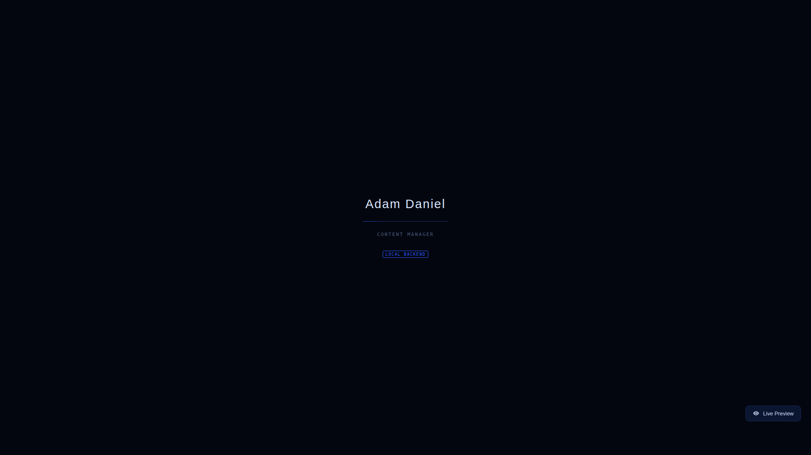

URL: [http://localhost:4000/admin/index-local#/](http://localhost:4000/admin/index-local#/)

Captured by `e2e/cms-smoke.spec.js` → _admin loads, logs in, creates a tag, saves it, deletes it_ on `chromium-desktop-3k` at 2026-05-14T21:11:17.058Z.

---

## Browsing collections

### 1.2. Land on the collections list

After login, the sidebar lists every collection defined in `admin/config.yml` — Posts, Tags, Projects, Pages. Click any entry to drill into its index, or use the search box at the top to jump straight to a known entry by title.

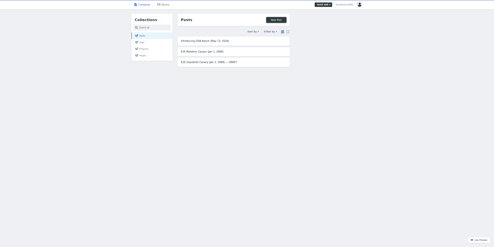

URL: [http://localhost:4000/admin/index-local#/collections/posts](http://localhost:4000/admin/index-local#/collections/posts)

Captured by `e2e/cms-smoke.spec.js` → _admin loads, logs in, creates a tag, saves it, deletes it_ on `chromium-desktop-3k` at 2026-05-14T21:11:17.647Z.

### 2.1. Open a collection

Each collection lands on its own index page — a list of every entry on disk plus a New button. The Tags collection is the simplest schema (name + description) so it loads instantly; Posts and Projects can take a couple seconds on a cold cache.

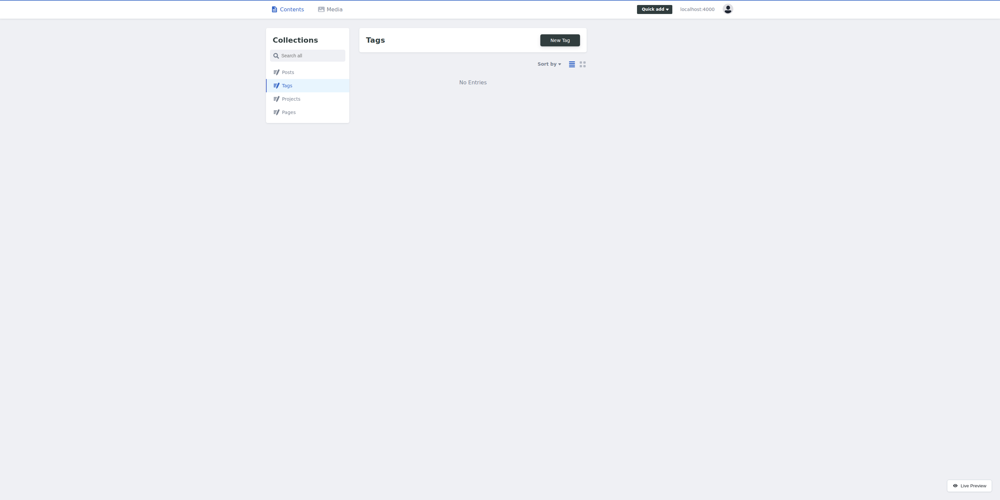

URL: [http://localhost:4000/admin/index-local#/collections/tags](http://localhost:4000/admin/index-local#/collections/tags)

Captured by `e2e/cms-smoke.spec.js` → _admin loads, logs in, creates a tag, saves it, deletes it_ on `chromium-desktop-3k` at 2026-05-14T21:11:18.175Z.

---

## Editing a post

### 3.1. The Posts edit form

The Posts edit form renders every field declared in `admin/config.yml`: Title, URL Slug, Date, Excerpt, Tags, Featured Image, Published, Publish Date, and the Body markdown editor. Edits are saved as a draft until you flip Status to Ready — a Save in the local backend writes straight to `_posts/`, but in production it opens a PR.

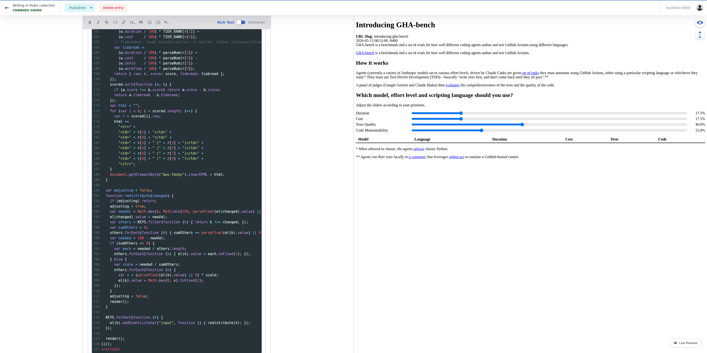

URL: [http://localhost:4000/admin/index-local#/collections/posts/entries/2026-05-12-agents-authoring-github-actions-choosing-a-model-and-language](http://localhost:4000/admin/index-local#/collections/posts/entries/2026-05-12-agents-authoring-github-actions-choosing-a-model-and-language)

Captured by `e2e/cms-smoke.spec.js` → _Posts edit form: every declared field renders with visible content_ on `chromium-desktop-3k` at 2026-05-14T21:11:23.136Z.

### 3.2. Open an existing post in the editorial workflow

Editorial workflow mode loads the existing entry into a fully editable form. Every widget — Title, Slug, Date, Body, Tags, Featured Image — is enabled (no read-only state) and the toolbar shows a Status dropdown plus a Delete published entry button.

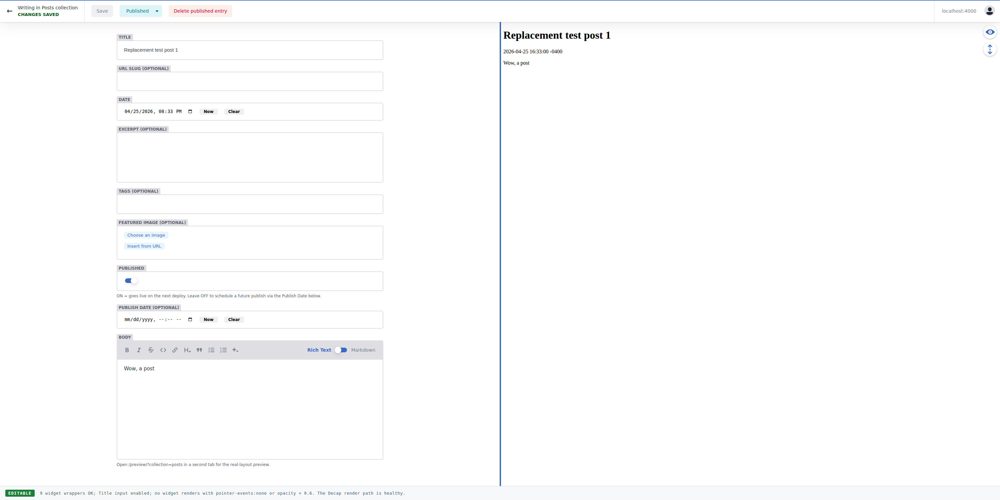

URL: [http://localhost:4000/admin/index-test#/collections/posts/entries/2026-04-25-replacement-test-post-1](http://localhost:4000/admin/index-test#/collections/posts/entries/2026-04-25-replacement-test-post-1)

Captured by `e2e/cms-editorial-workflow.spec.js` → _opening an existing post renders all fields editable + Delete button enabled_ on `chromium-desktop-3k` at 2026-05-14T21:11:02.600Z.

---

## Marking ready and publishing

### 5.1. Save in editorial workflow

With `publish_mode: editorial_workflow`, the toolbar's primary action is **Save** rather than Publish. The first Save creates a `cms/posts/<slug>` branch and opens a PR; subsequent Saves push commits onto that branch. The PR appears with the `cms/draft` label and stays in draft until you change the Status.

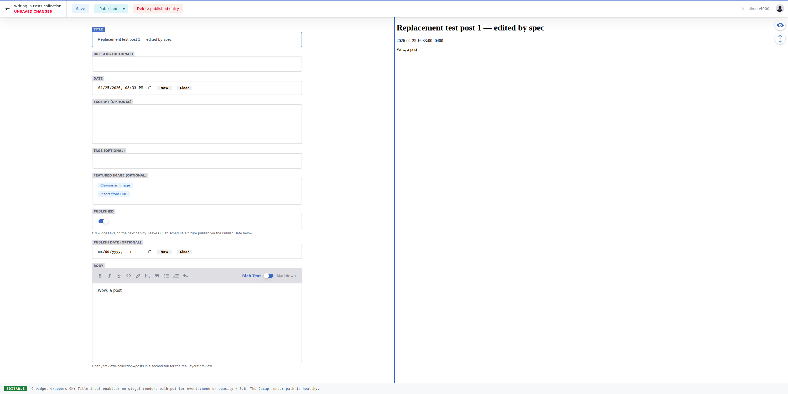

URL: [http://localhost:4000/admin/index-test#/collections/posts/entries/2026-04-25-replacement-test-post-1](http://localhost:4000/admin/index-test#/collections/posts/entries/2026-04-25-replacement-test-post-1)

Captured by `e2e/cms-editorial-workflow.spec.js` → _editing an existing post and saving creates a workflow draft_ on `chromium-desktop-3k` at 2026-05-14T21:11:08.092Z.

### 6.1. Filled-out post ready to publish

Title, slug, body, tags, and the Published toggle are all set. In editorial workflow mode (production), the toolbar shows **Save** and a separate Status dropdown; clicking Save opens a PR in draft. Setting the dropdown to **Ready** is what triggers the auto-merge.

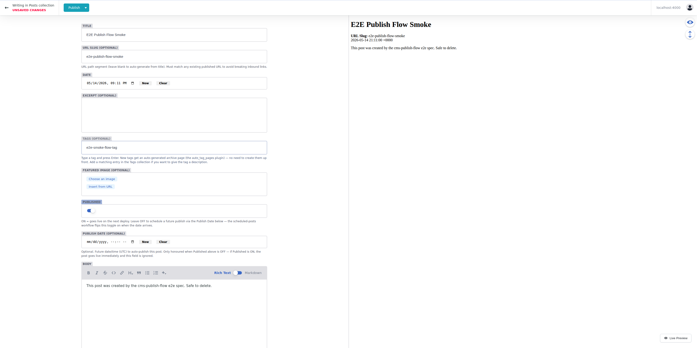

URL: [http://localhost:4000/admin/index-local#/collections/posts/new](http://localhost:4000/admin/index-local#/collections/posts/new)

Captured by `e2e/cms-publish-flow.spec.js` → _create a post in Decap, rebuild, and assert /blog/<slug>/ renders it_ on `chromium-desktop-3k` at 2026-05-14T21:11:02.927Z.

### 6.2. Publish menu open

Decap's primary button is a split control. Clicking the Publish trigger opens a menu — **Publish now** commits the entry; **Publish and create new** commits then routes you to a fresh blank entry. In editorial-workflow mode this is replaced with a Save → Status flow.

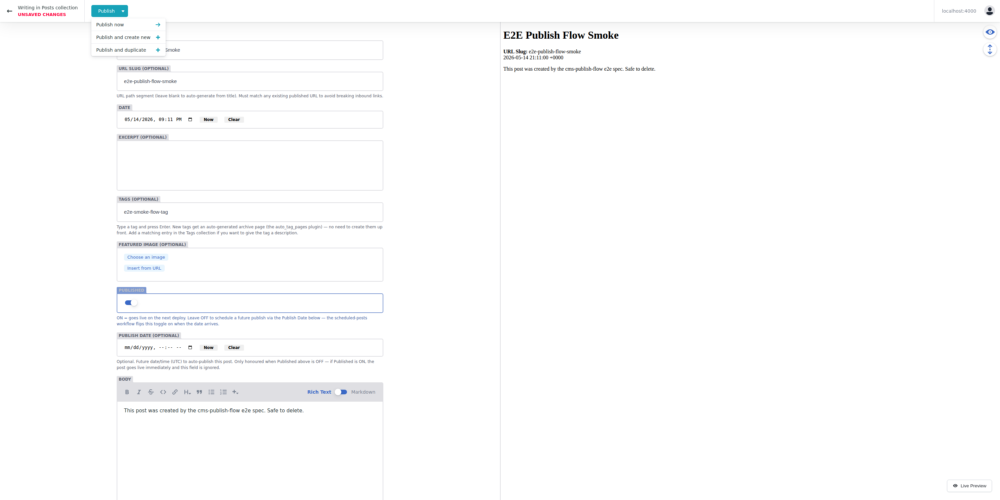

URL: [http://localhost:4000/admin/index-local#/collections/posts/new](http://localhost:4000/admin/index-local#/collections/posts/new)

Captured by `e2e/cms-publish-flow.spec.js` → _create a post in Decap, rebuild, and assert /blog/<slug>/ renders it_ on `chromium-desktop-3k` at 2026-05-14T21:11:03.280Z.

### 6.3. Published post live

After the publish settles, the post is reachable at its public URL — here `/blog/<slug>/`. In production the same URL pattern is served by CloudFront once `deploy-production.yml` finishes its `aws s3 sync` and invalidation, typically within ~2 minutes of the merge.

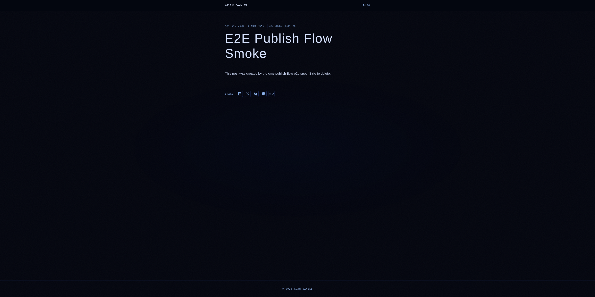

URL: [http://localhost:4000/blog/e2e-publish-flow-smoke/](http://localhost:4000/blog/e2e-publish-flow-smoke/)

Captured by `e2e/cms-publish-flow.spec.js` → _create a post in Decap, rebuild, and assert /blog/<slug>/ renders it_ on `chromium-desktop-3k` at 2026-05-14T21:11:08.531Z.

---

## Verifying on the public site

### 7.1. Saved entry

On the local backend the file is written straight into the working tree (here, `_tags/<slug>.md`) and the editor routes to the entry view. In production the same Save lands on a fresh `cms/<timestamp>` branch and opens a PR — and the `cms-editorial-workflow.yml` workflow then runs validate-content, publishes a `preview-pr<N>.adamdaniel.ai` build, and waits for you to set Status to Ready.

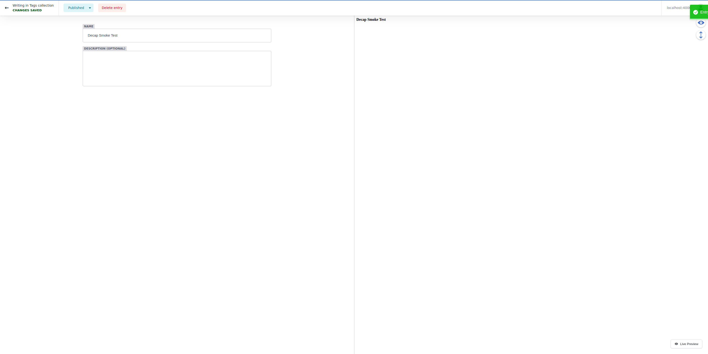

URL: [http://localhost:4000/admin/index-local#/collections/tags/entries/decap-smoke-test](http://localhost:4000/admin/index-local#/collections/tags/entries/decap-smoke-test)

Captured by `e2e/cms-smoke.spec.js` → _admin loads, logs in, creates a tag, saves it, deletes it_ on `chromium-desktop-3k` at 2026-05-14T21:11:19.121Z.

---

## Deleting an entry

### 8.1. Delete entry button

The toolbar's Delete button is only available once the entry exists on disk — the button label is **Delete entry** for unpublished drafts and **Delete published entry** for live posts. In production this opens a deletion PR; it does not bypass review.

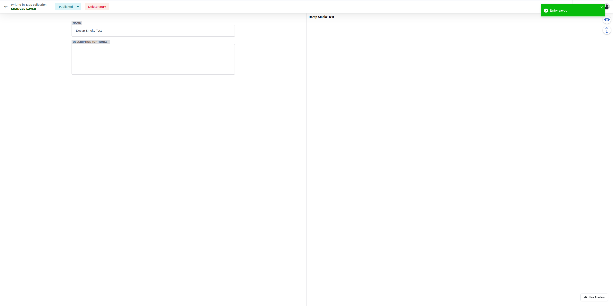

URL: [http://localhost:4000/admin/index-local#/collections/tags/entries/decap-smoke-test](http://localhost:4000/admin/index-local#/collections/tags/entries/decap-smoke-test)

Captured by `e2e/cms-smoke.spec.js` → _admin loads, logs in, creates a tag, saves it, deletes it_ on `chromium-desktop-3k` at 2026-05-14T21:11:19.282Z.

### 8.2. Entry removed

Once the deletion lands, Decap routes back to the collection index and the entry is gone from the list. On the local backend the source file is also removed from disk; in production the deletion PR removes it from `main` once the workflow auto-merges.

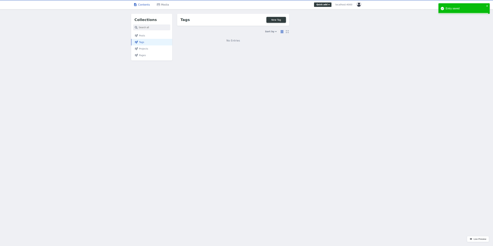

URL: [http://localhost:4000/admin/index-local#/collections/tags](http://localhost:4000/admin/index-local#/collections/tags)

Captured by `e2e/cms-smoke.spec.js` → _admin loads, logs in, creates a tag, saves it, deletes it_ on `chromium-desktop-3k` at 2026-05-14T21:11:19.718Z.

---
